# 资金余额情况表

位置：

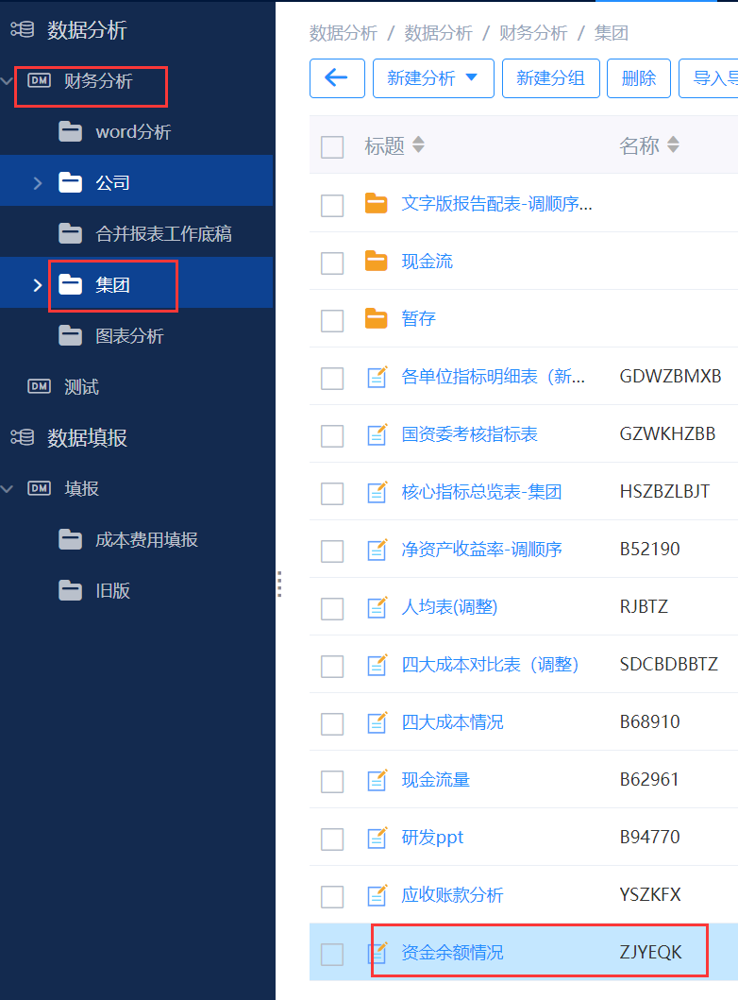

加了两行：咨策总控和集团本部：

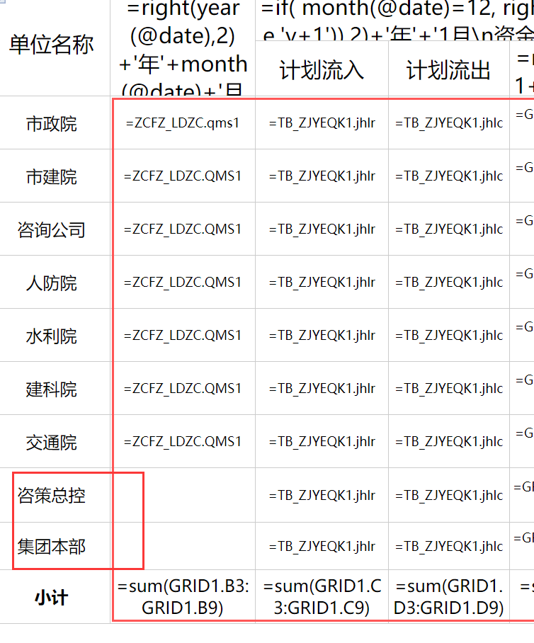

集团本部过滤条件为A01，即由A01级来填，咨策总控让周娟来填，~~他的账号组织级别为A，所以也用A来过滤。~~

## 改动1

`资金余额情况`，现在从两张主题表中取数，分别为`TB_ZJYEQK1`和`ZJYEQK_CHFY`：

两张主题表的位置：

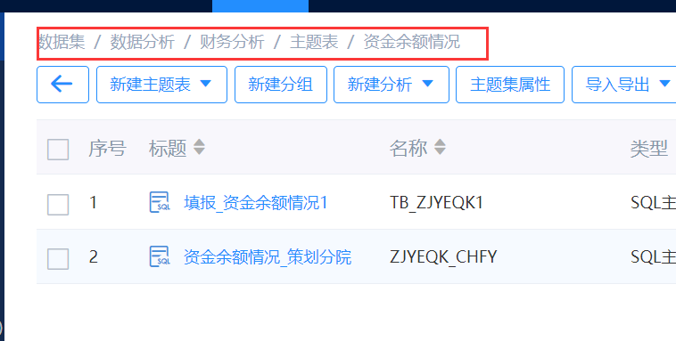

策划分院(咨策总控)从`ZJYEQK_CHFY`取数，其他从`TB_ZJYEQK1`中取数，而`ZJYEQK_CHFY`表的数据由周娟填写，其填报主题表的位置：

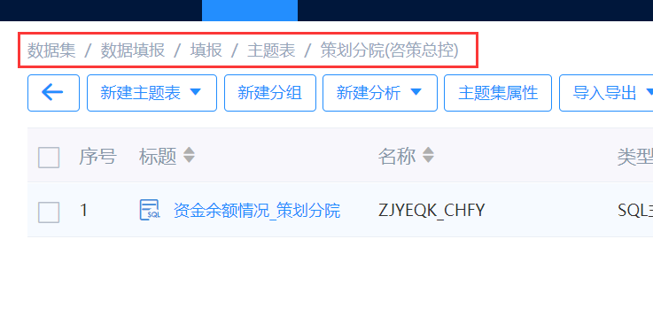

填报位置：

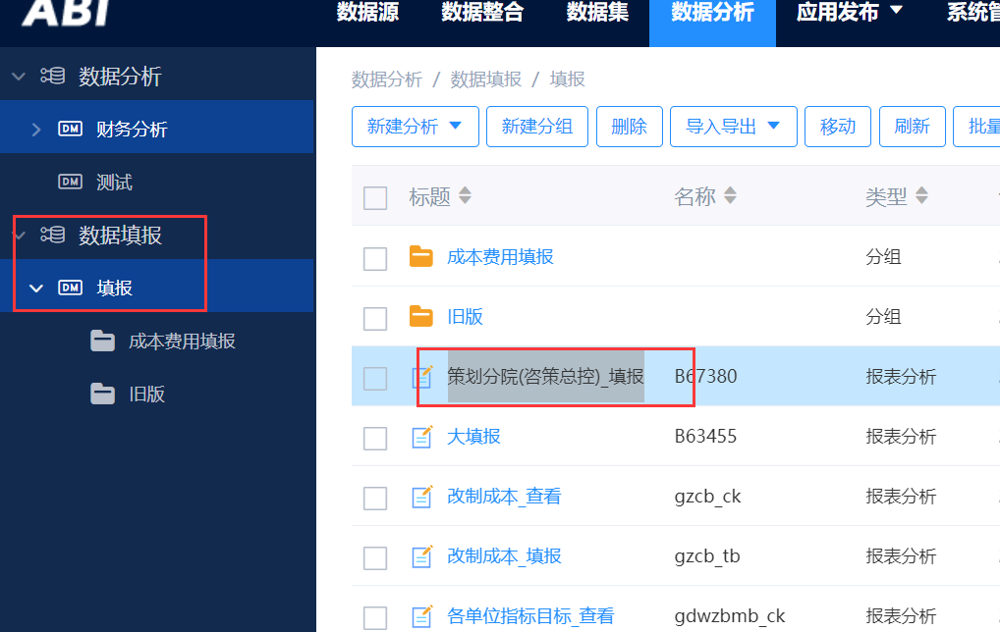

最终`资金余额情况表`的表样：

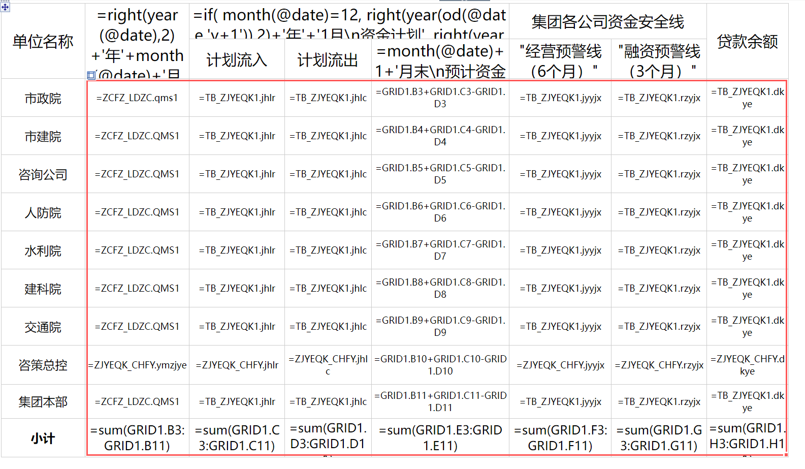

# 策划分院(咨策总控)_填报

策划分院填报，是周娟来填。用一张总共的填报来填策划分院，跟大填报一样，位置：

包括后面涉及到策划分院的填报，就往这里加。

# 应收账款分析

位置：

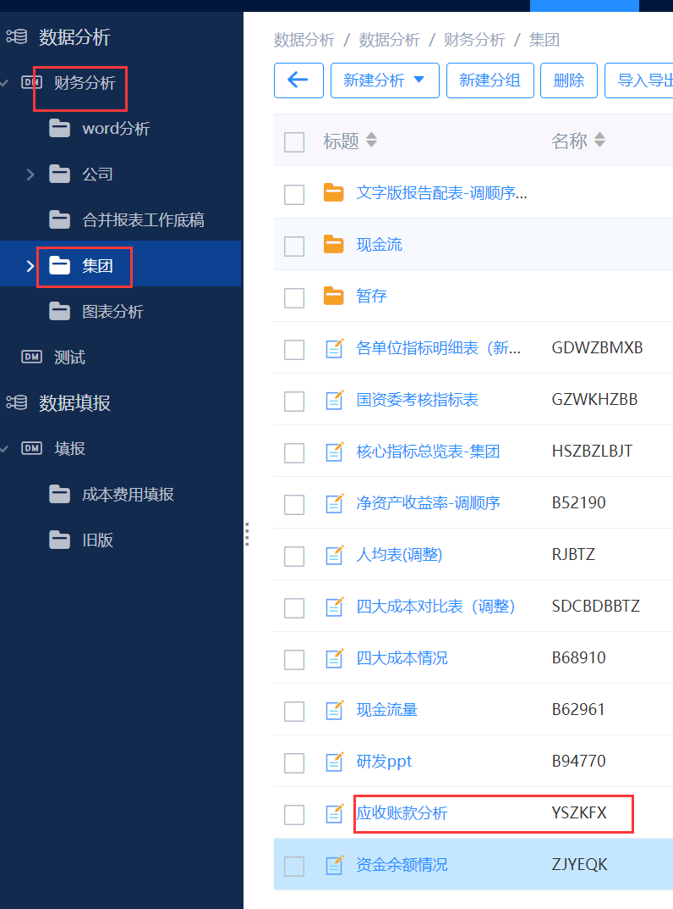

现在加入策划分院(咨策总控)行：

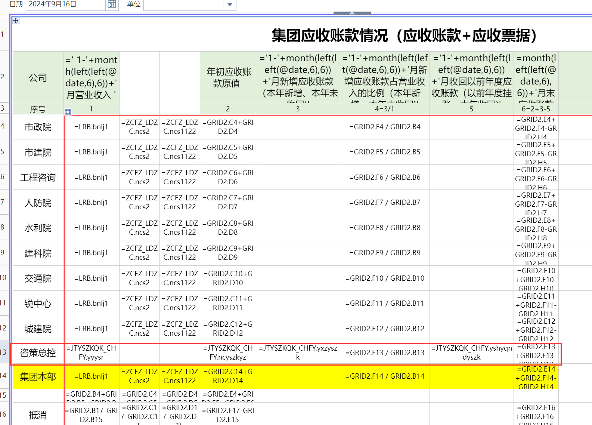

从`JTYSZKQK_CHFY`中取数，位置：

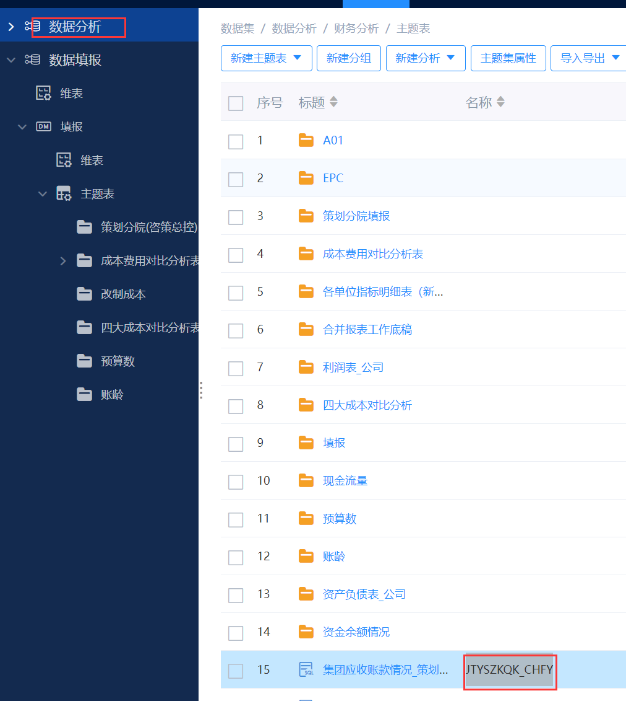

需要周娟填，填报主题表位置：

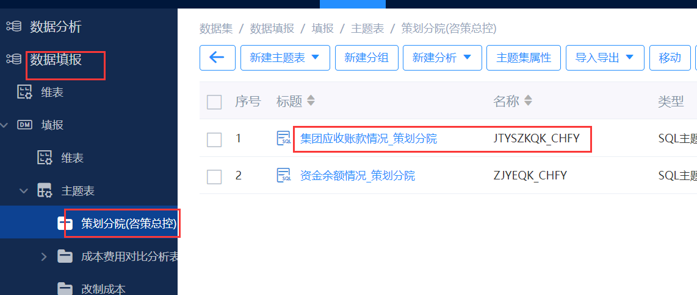

填报放到`策划分院(咨策总控)_填报`中：

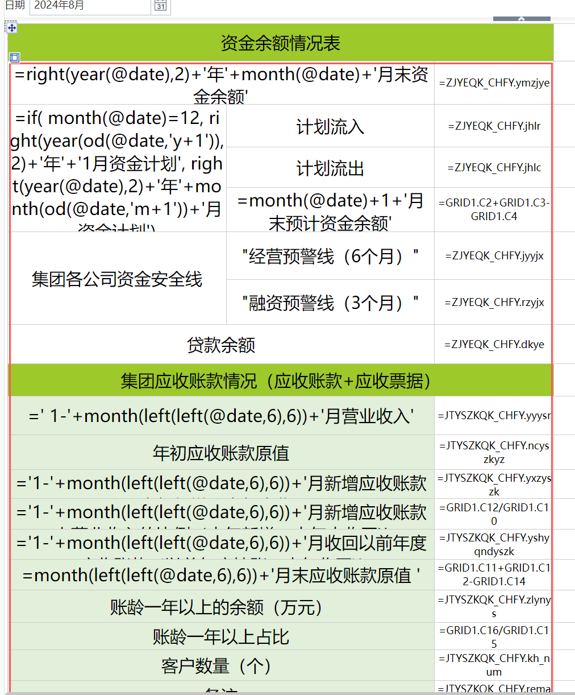

# 研发PPT

位置：

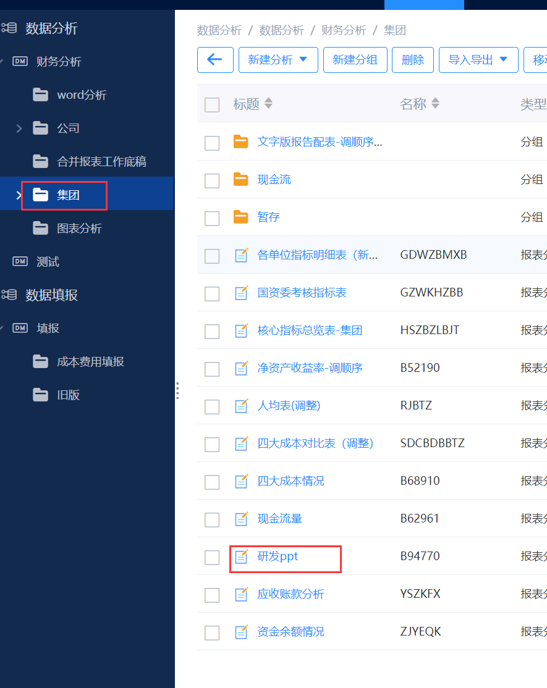

按需改动，需求如下：

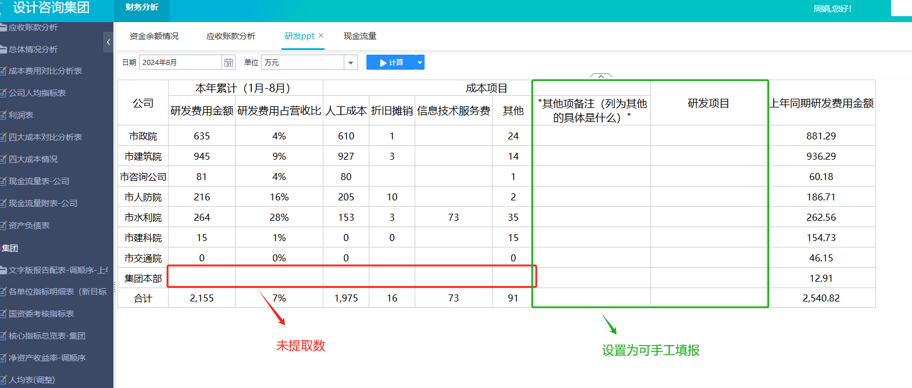

此改动为填报改动，新增填报，没有策划分院，所以在大填报中增加：

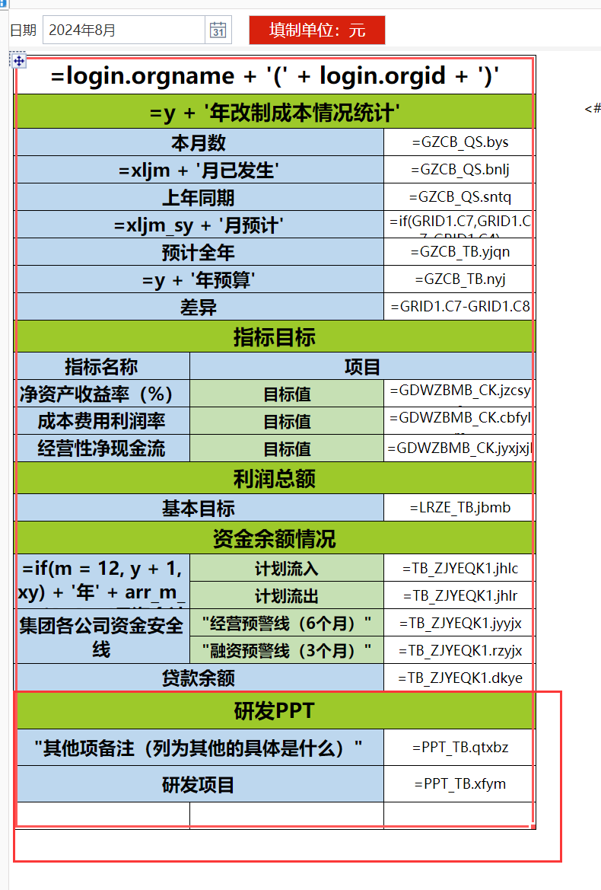

填报的主题表位置：

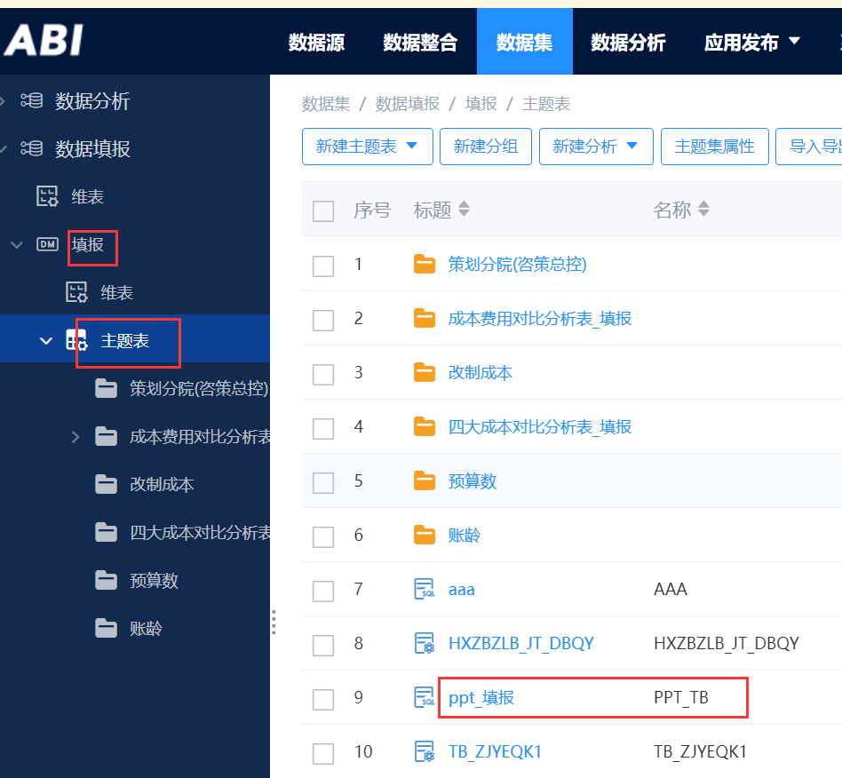

取数主题表位置：

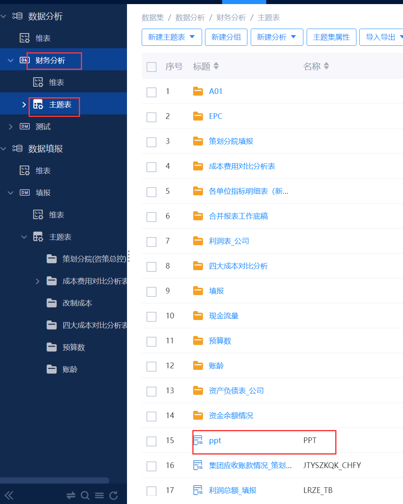

