# 1 文字-调顺序

## 1.1 营业收入

营业收入中基本目标字段需要多个分院填报，现在把它抽取到`大填报`中。

建表：

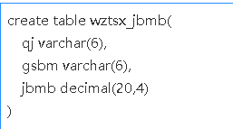

`wztsx_jbmb`这张表就用于存放文字-调顺序中子表中的基本目标字段。

填报级主题表：

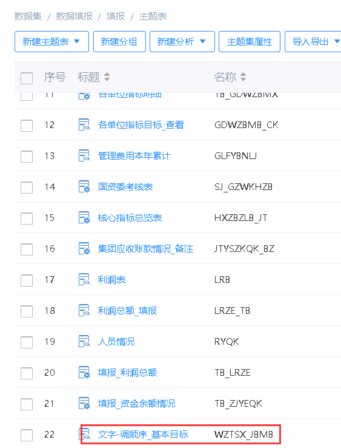

财务级主题表：

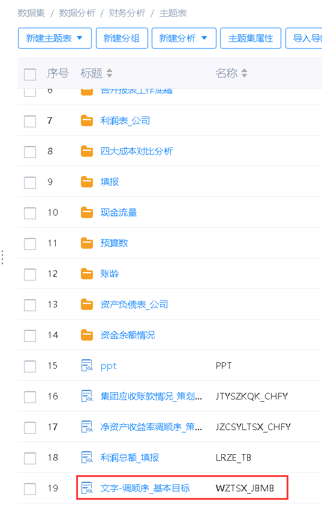

然后将营业收入的旧版主题表换成新版：

`YYSR_JBMB`->`WZTSX_JBMB`

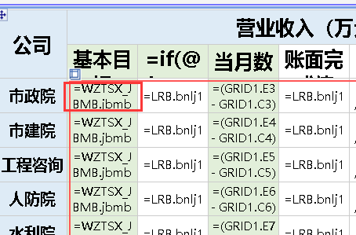

数据迁移，原来的表数据：

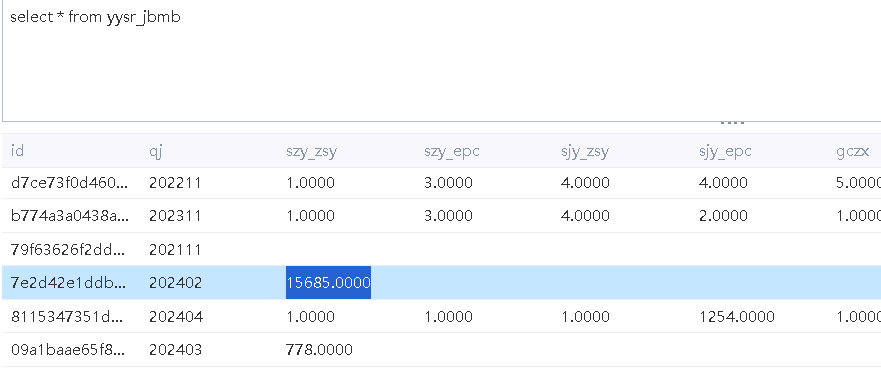

只迁移202402和202403：

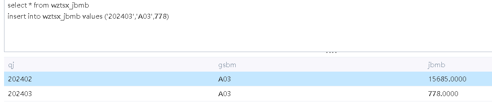

## 1.2 利润总额

也是基本目标，在`wztsx_jbmb`的基础上添加字段：

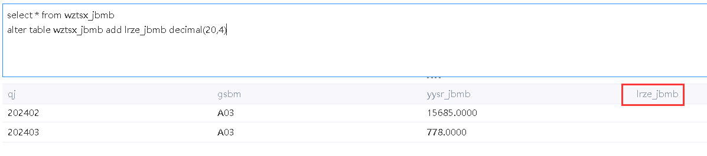

主题表同步：

换成新主题表：`LRZE_TB`->`wztsx_jbmb`：

`大填报`添加：

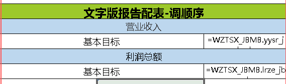

数据迁移：

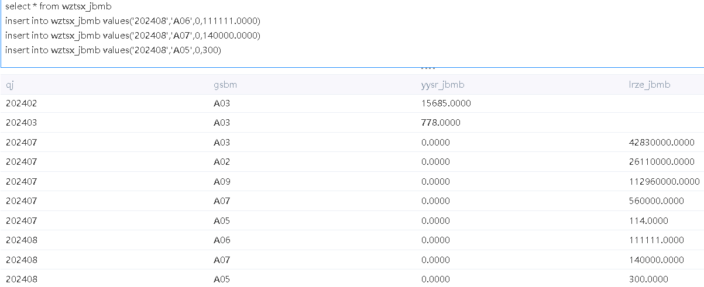

# 2 大填报

在文字版调顺序时，发现已经存在利润总额填报：

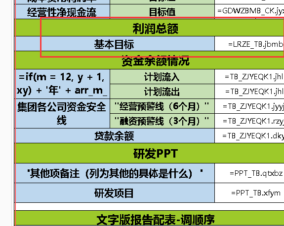

它用到的主题表是`LRZE_TB`，物理表是`lrbze_tb`，就是老版本的主题表：

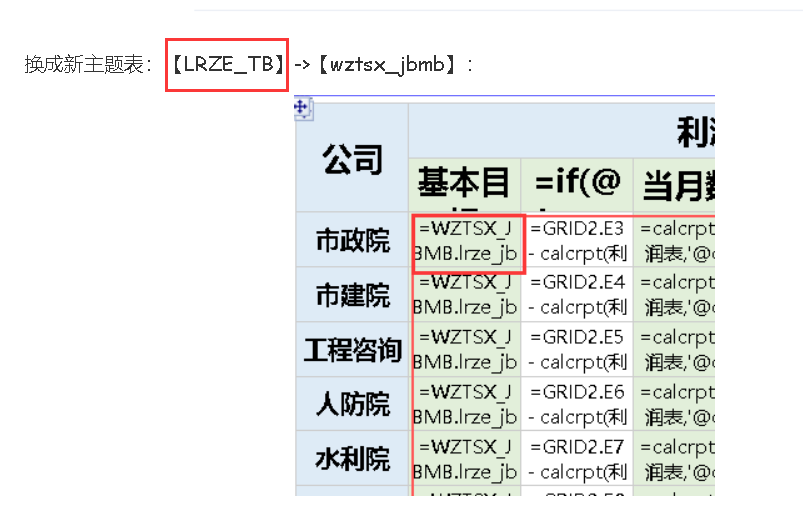

我把这行删除。

# 3 各单位指标明细表(新目标)

这张表有各个分院的基本目标：

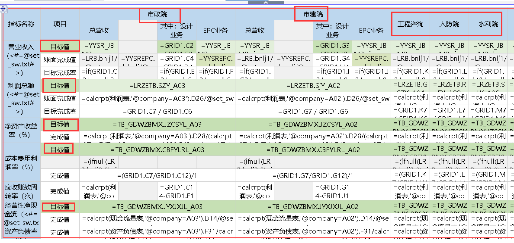

用的是老版本的主题表。

而且市政院和市建院的基本目标还包括EPC业务，这些基本目标中营业收入和利润总额各分院在大填报中填写，而大填报中的基本目标都只有一个，所以，我需要在大填报中为营业收入再增加一个EPC的字段，还得根据不同分院来控制显隐。

物理表这里加一个字段：

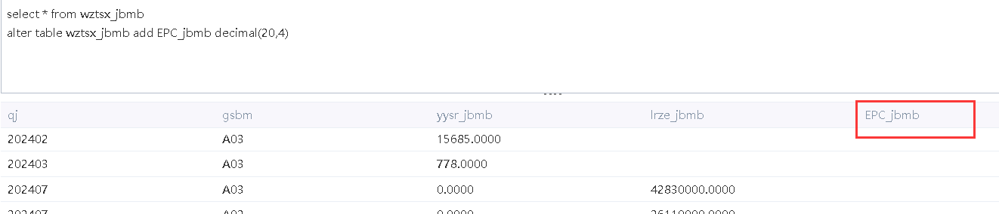

主题表同步：

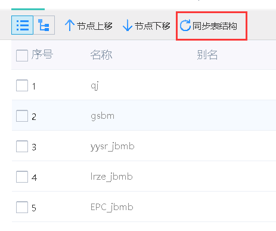

`大填报`加字段：

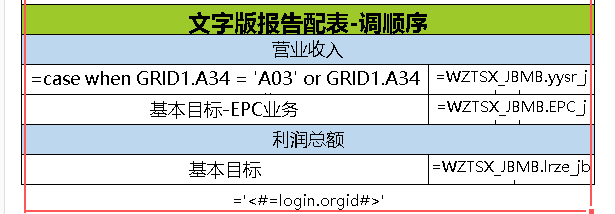

然后把老版本主题表换成新版本：

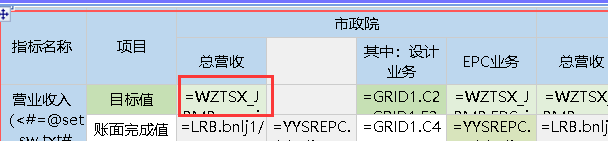

数据迁移：

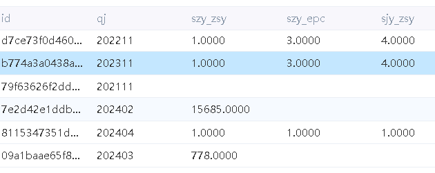

迁移24年2月和3月，但是没有EPC数据，就没有迁移。

接着改利润总额这部分：

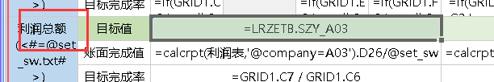

它没有EPC，直接用`大填报`的：

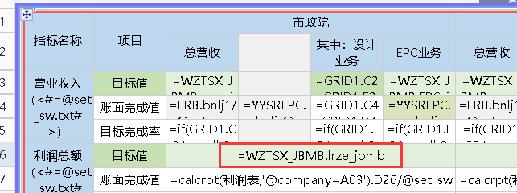

然后是下面的三个指标：

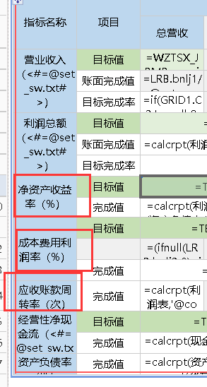

- 净资产收益率
- 成本费用利润率
- 应收账款周转率

3张表原本用的主题表是这张：`TB_GDWZBMX`：

就是用来给`各单位指标明细表(新目标)`填报的。然后在`大填报`中有这3个字段：

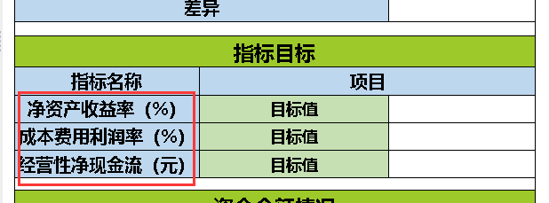

`大填报`中的这3个字段来自这张表：

这样来看，这张`各单位指标目标`就是从`各单位指标明细表(新目标)`中抽取出这3个字段做的表。既然`大填报`中有了，我就直接拿来用：

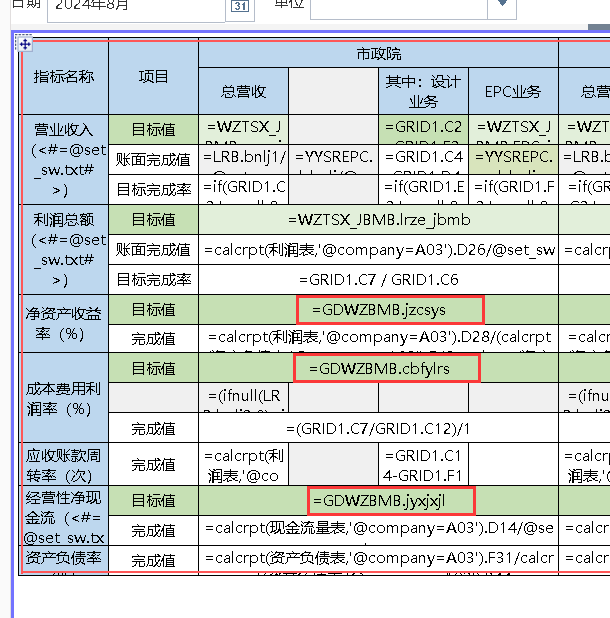

数据迁移

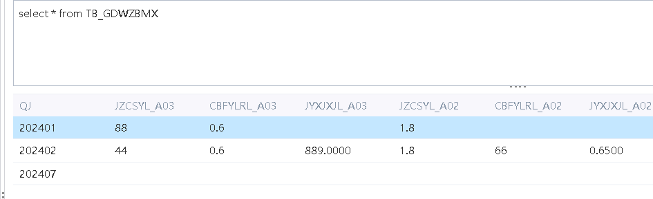

都迁移，然后我发现已经迁移过了：

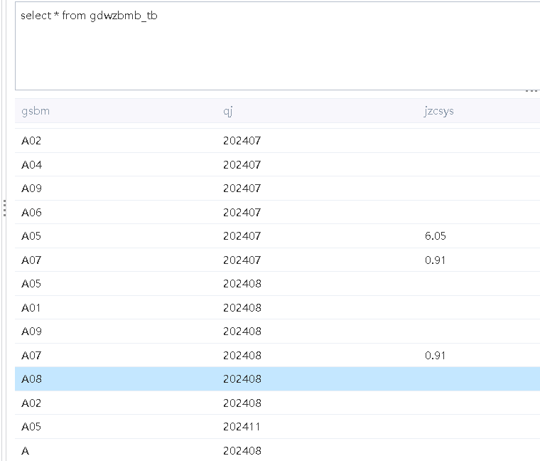

那就不迁移了，最后把按钮去掉。

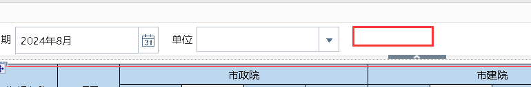

# 4 国资委考核指标表

在集团和填报级下面都有这张表：

同时还有填报表：

应该是为填报级的`国资委考核指标表`做的。既然有填报表，那我直接用这张填报表，然后填报级下的`国资委考核指标表`就不要了。

首先查看集团级的国资委，它也有填报，它的填报指向填报级下的国资委填报。也就是说集体级和填报级下的国资委的填报均来自填报级下的国资委填报。

既然如此，我就把集体级的按钮指向改一下，改成外链式：

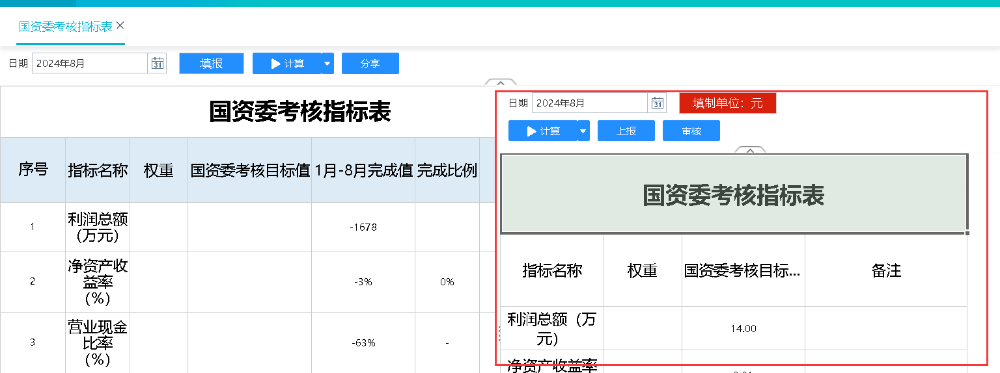

然后消表，填报级只留下国资委填报：

# 5 填报级

主要是消表：

各单位指标目标_查看消了：

因为在这张表中可以看：

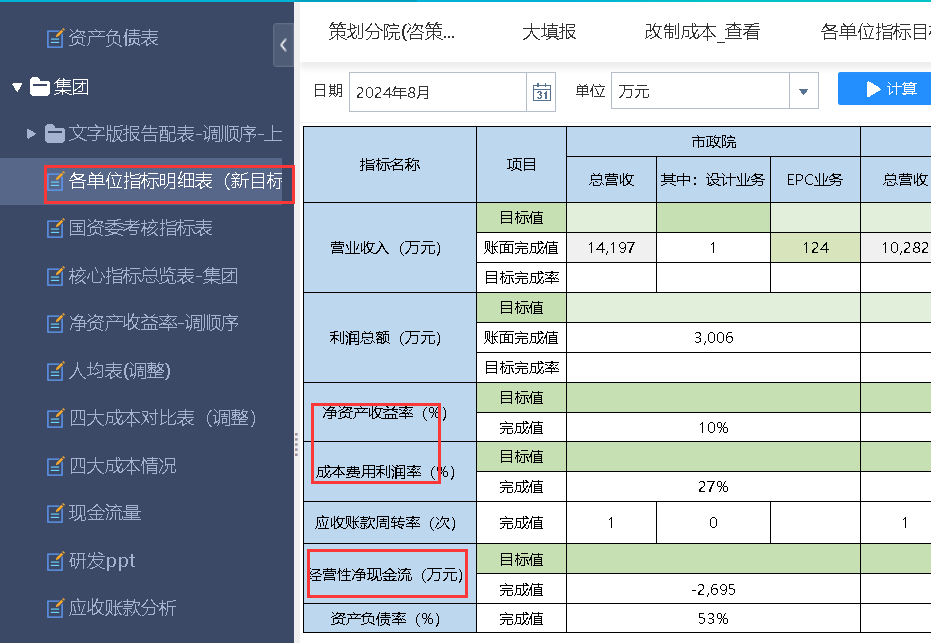

这张也消了：

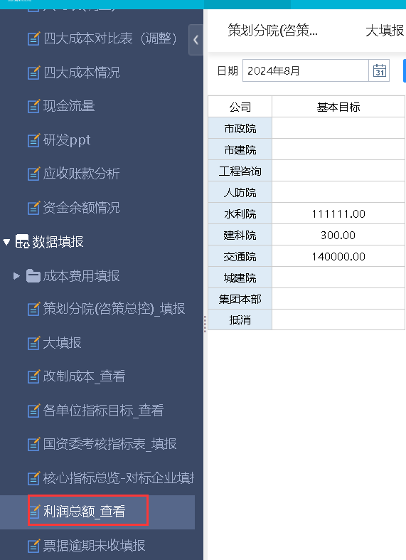

在这张中可以看：

这张消了：

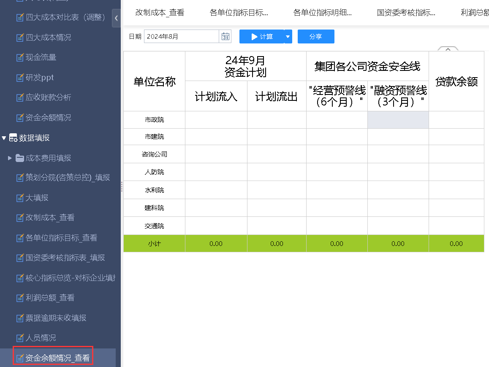

在这里可以看：

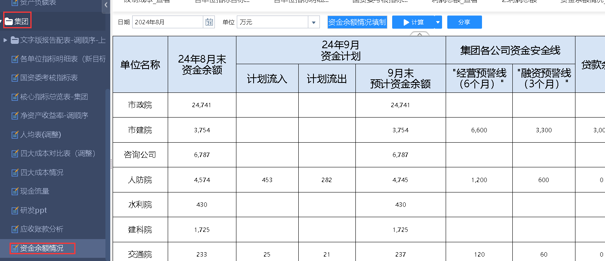

