# 1 到票据逾期未收填报

填报表长这样：

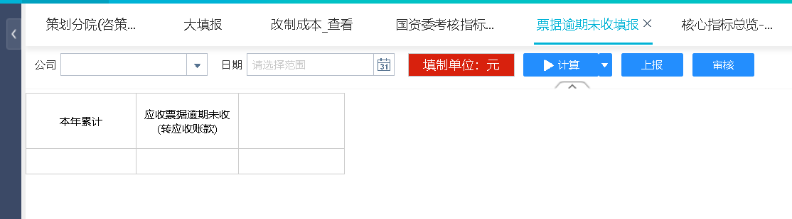

位置：

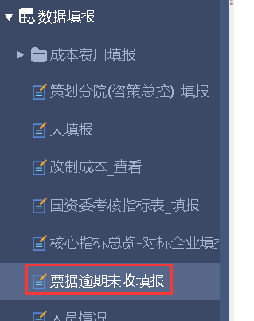

这张填报表是应收票据的填报：

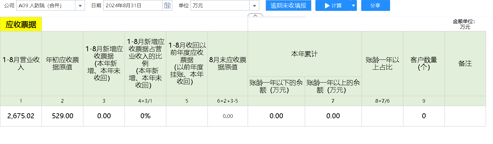

位置：

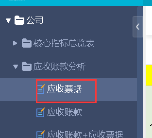

在填报中，实际填的是【ZL_YQWSTB】主题表，表示逾期未收。

填报表中第1个单元格取的是【ZL_SHBND_YSPJ】主题表：

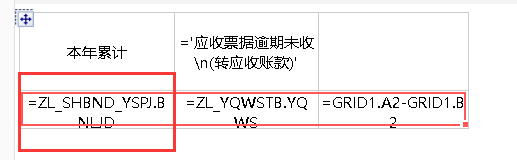

而【ZL_SHBND_YSPJ】来自【ZL_SHYQND】：

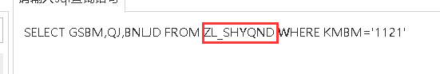

而【ZL_SHYQND】是通过账龄任务流生成的：

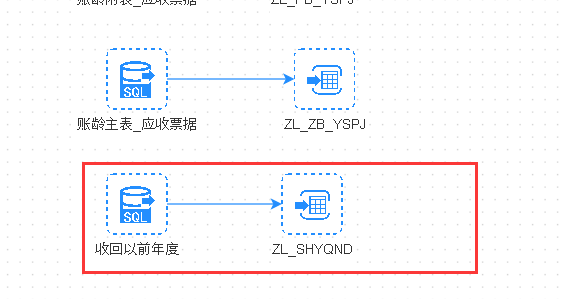

那么它这个格子就不是填报，然后是第2个格子，主题表是【ZL_YQWSTB】：

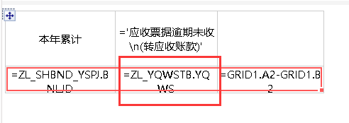

位置：

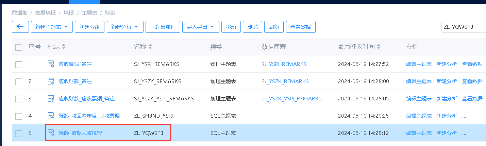

从名字可以看出，它应该是填报的表。

它来自【ZL_YSPJ_YQWS】：

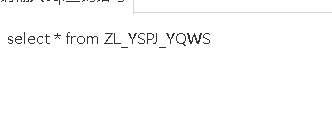

【ZL_YSPJ_YQWS】一条数据也没有：

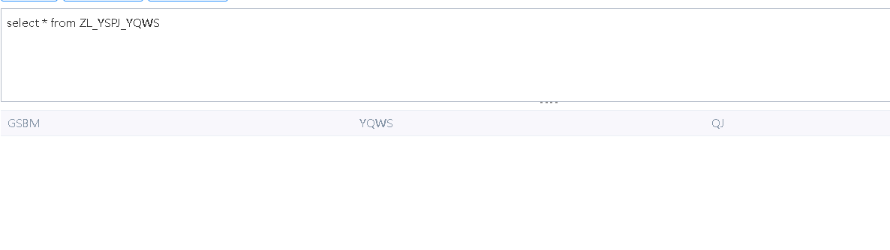

第3个格子是前两个格子计算：

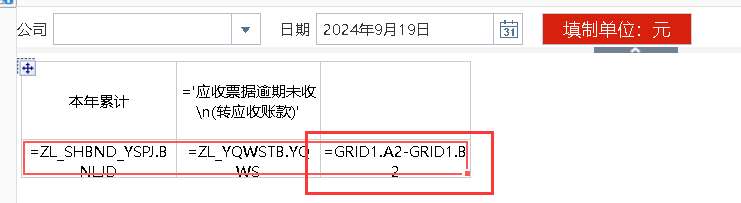

所以，整个填报的格子只有第2个。

它填的内容不会直接展示在应收票据上，而是通过计算然后再展示：

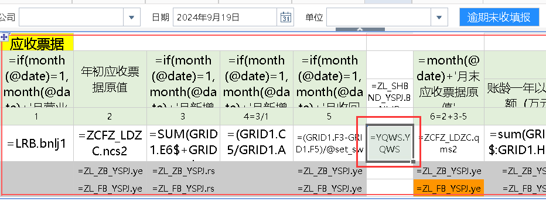

这个格子的主题表是【YQWS】,它也来自【ZL_YSPJ_YQWS】，而且取的字段也是【YQWS】，可见这个格子就是【到票据逾期未收填报】填报的格子。

在应收票据中，【YQWS】主要用来计算出这个格子：

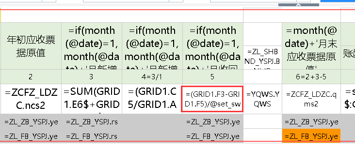

它等于①-②：

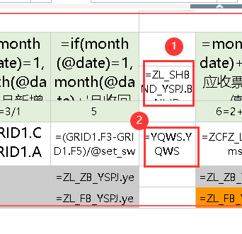

②上面说过了，是填报的数据，而①恰好是填报表的第一个格子，①-②也是填报表的第3个格子：

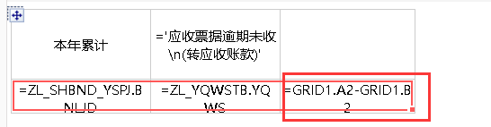

所以我把第3个格子的名字改为同应收票据：

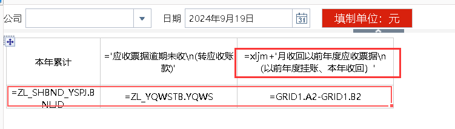

# 2 四大成本情况

占营业收入比，加上填报：

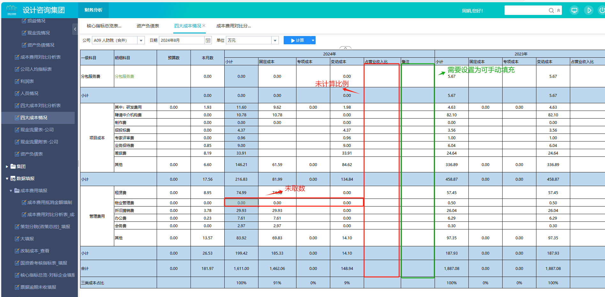

主题表：

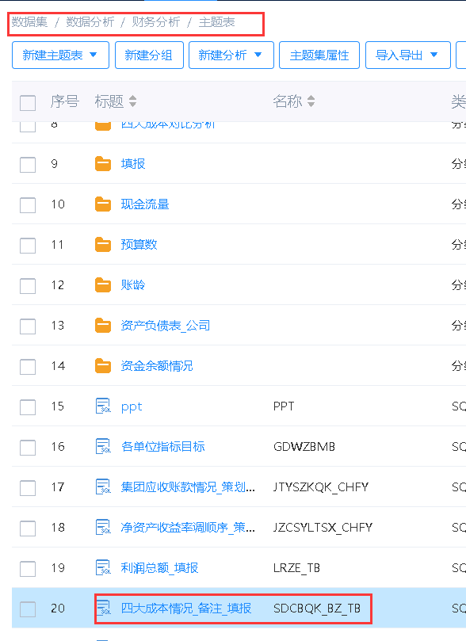