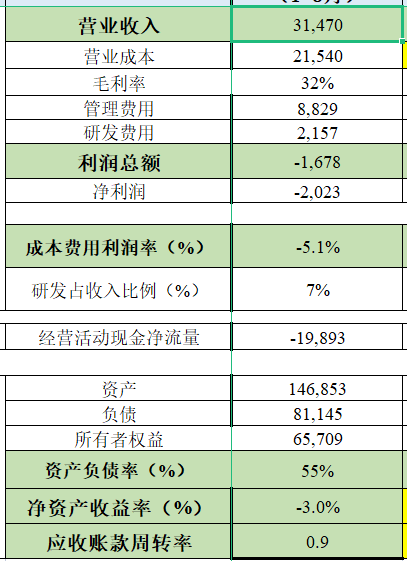
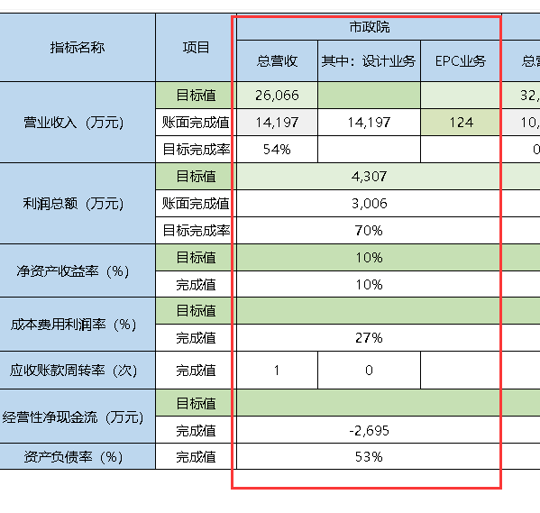
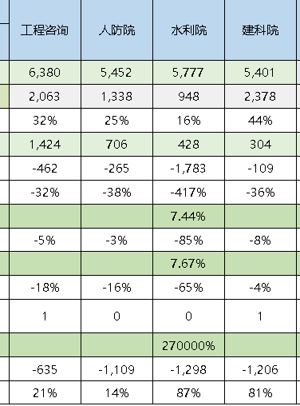
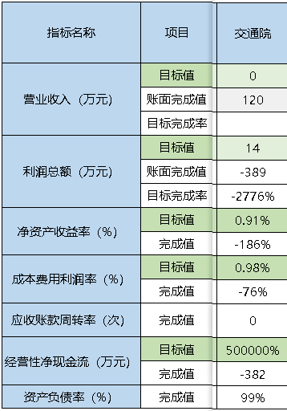

# 1 核心指标总览表

本年累计(1-8月)这一列，数据相差不大：

下一列**上年同期**，没有参考性，略。

下一列，**同比**，万元百分比计算没有问题。

下两列，表间取数(对标企业)，从E和F取数

与excel上差异较大。

下一列，**同比**，万元百分比计算没有问题。

# 2 各单位指标明细表

市政院这列没问题：

市建院这列没问题：

工程咨询、人防院、水利院、建科院这几列没有问题：

交通院这列，除了营业目标值这里没有数据，其他都是合适的，推测交通院还没有填：

