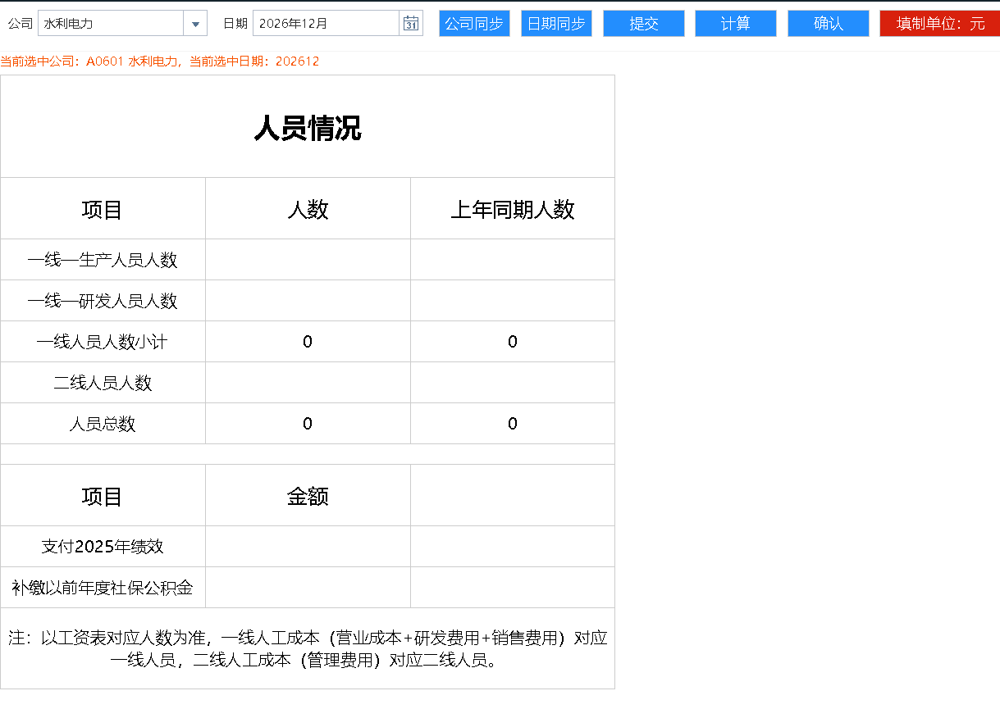
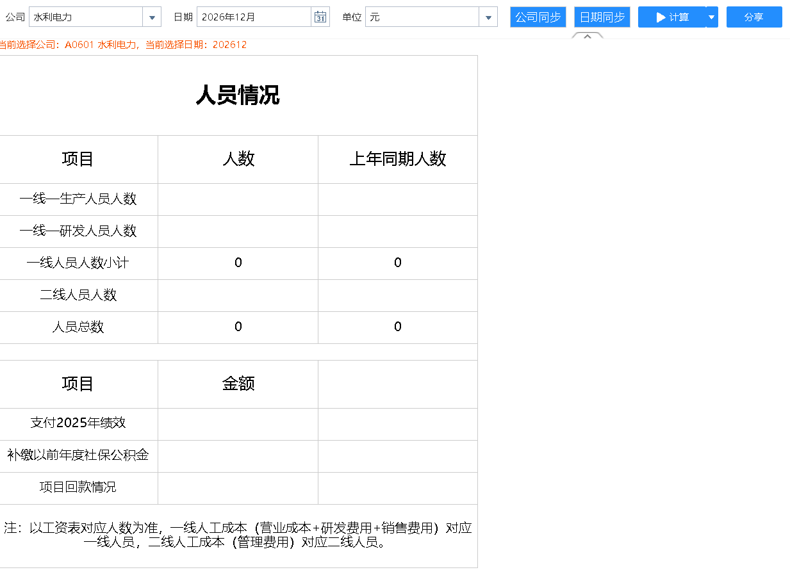

# **填报表确认和退回演示**

以`A0601`、`202612`期间、`人员情况表`为例

人员情况表有两张，一张填报，一张查看：

`填报表`如下：

`查看表`如下：

现填入测试数据并上报：

.gif)

`查看表`中能看的上报的数据：

-1735108233836-2.gif)

上报后仍然可以修改`填报表`中的数据：

-1735108561961-1.gif)

点击`确认`，弹出提示框，提示确认后无法修改数据，再次确认，此时无法修改数据，同时`确认`按钮消失：

-1735108834357-3.gif)

`查看表`中刷新页面，出现`退回`按钮(只有当填报表确认后，才会出现)，检查数据，如果有误则退回，在`填报表`中又能重新修改数据，同时`确认`按钮出现：

-1735109508213-1.gif)

调整数据后，再次确认核对。如仍有错误，则退回修改，重复上述流程直至数据无误。